<picture>
  <source media="(max-width: 600px) and (prefers-color-scheme: dark)" srcset="assets/hero-mobile-dark.svg">
  <source media="(max-width: 600px)" srcset="assets/hero-mobile-light.svg">
  <source media="(prefers-color-scheme: dark)" srcset="assets/hero-dark.svg">
  
</picture>

<a href="https://www.linkedin.com/in/aljasseralghamdi">
<picture>
  <source media="(prefers-color-scheme: dark)" srcset="assets/chip-linkedin-dark.svg">
  
</picture>
</a>
&nbsp;&nbsp;
<a href="https://orcid.org/0009-0006-4342-7452">
<picture>
  <source media="(prefers-color-scheme: dark)" srcset="assets/chip-orcid-dark.svg">
  
</picture>
</a>
&nbsp;&nbsp;
<a href="mailto:AlJasserAlGhamdi@gmail.com">
<picture>
  <source media="(prefers-color-scheme: dark)" srcset="assets/chip-email-dark.svg">
  
</picture>
</a>

Cybersecurity and AI researcher in Jeddah. I build defenses for machine-learning systems and security operations, and captain CTF teams for sport.

> [!NOTE]
> Open to research collaboration in ML security, SOC automation and digital forensics.

<picture>
  <source media="(max-width: 600px) and (prefers-color-scheme: dark)" srcset="assets/highlights-mobile-dark.svg">
  <source media="(max-width: 600px)" srcset="assets/highlights-mobile-light.svg">
  <source media="(prefers-color-scheme: dark)" srcset="assets/highlights-dark.svg">
  
</picture>

## Arena

| Event | Result | Field |
|---|---|---|
| Black Hat MEA CTF 2025 | Top 5 Saudi teams, captain, first blood | national finals |
| KAUST Academy CTF | 1st place | 50 participants |
| King Abdulaziz University CTF | 1st place | 50 teams |
| Jeddah International College CTF | 1st place | 30 teams |
| KAUST Academy Cybersecurity hackathon | Top 3 in the Kingdom, SIEM and SOAR platform for Jarir | led a team of 5 |
| KAUST Academy AI program competition | 3rd place | 100 selected from 17,000+ |
| KAUST Academy Kaggle tournament | Top 5 | program-wide |
| Aramco National Consulting Championship | Top 100, cases judged by Deloitte | 7,000+ students, 10 universities |

More honours

| Event | Result | Field |
|---|---|---|
| Cybersecurity Pioneer Award | King Abdulaziz University | award |
| Certificate of Excellence, Dean of Student Affairs | 2024–25 and 2025–26 | award |
| Certificate of Recognition | KAU President | award |
| Certificate of Appreciation | Dean of FCIT, Cybersecurity Club | award |
| TechHub3 CTF, KAU | Designed and ran the competition | 100+ participants, 2026 |
| Cybersecurity Club, KAU | Led the CTF and technical teams, taught 1,000+ students | 2023–2026 |

## Credentials

<picture>
  <source media="(prefers-color-scheme: dark)" srcset="assets/certs-offensive-dark.svg">
  
</picture>
<picture>
  <source media="(prefers-color-scheme: dark)" srcset="assets/certs-defense-dark.svg">
  
</picture>
<picture>
  <source media="(prefers-color-scheme: dark)" srcset="assets/certs-foundations-dark.svg">
  
</picture>

## Projects

<a href="https://github.com/AlJasser-AlGhamdi/scan-to-controls">
<picture>
  <source media="(prefers-color-scheme: dark)" srcset="assets/cards/scan-to-controls-dark.svg">
  
</picture>
</a>
<picture>
  <source media="(prefers-color-scheme: dark)" srcset="assets/cards/phishing-dark.svg">
  
</picture>
<picture>
  <source media="(prefers-color-scheme: dark)" srcset="assets/cards/stolen-vehicle-dark.svg">
  
</picture>
<picture>
  <source media="(prefers-color-scheme: dark)" srcset="assets/cards/apk-scanner-dark.svg">
  
</picture>
<picture>
  <source media="(prefers-color-scheme: dark)" srcset="assets/cards/real-estate-dark.svg">
  
</picture>
<picture>
  <source media="(prefers-color-scheme: dark)" srcset="assets/cards/saudi-guider-dark.svg">
  
</picture>

## Activity

<picture>
  <source media="(prefers-color-scheme: dark)" srcset="https://raw.githubusercontent.com/AlJasser-AlGhamdi/AlJasser-AlGhamdi/output/3d-dark.svg">
  
</picture>

<picture>
  <source media="(max-width: 600px) and (prefers-color-scheme: dark)" srcset="https://raw.githubusercontent.com/AlJasser-AlGhamdi/AlJasser-AlGhamdi/output/activity-mobile-dark.svg">
  <source media="(max-width: 600px)" srcset="https://raw.githubusercontent.com/AlJasser-AlGhamdi/AlJasser-AlGhamdi/output/activity-mobile-light.svg">
  <source media="(prefers-color-scheme: dark)" srcset="https://raw.githubusercontent.com/AlJasser-AlGhamdi/AlJasser-AlGhamdi/output/activity-dark.svg">
  
</picture>

Jeddah, Saudi Arabia

